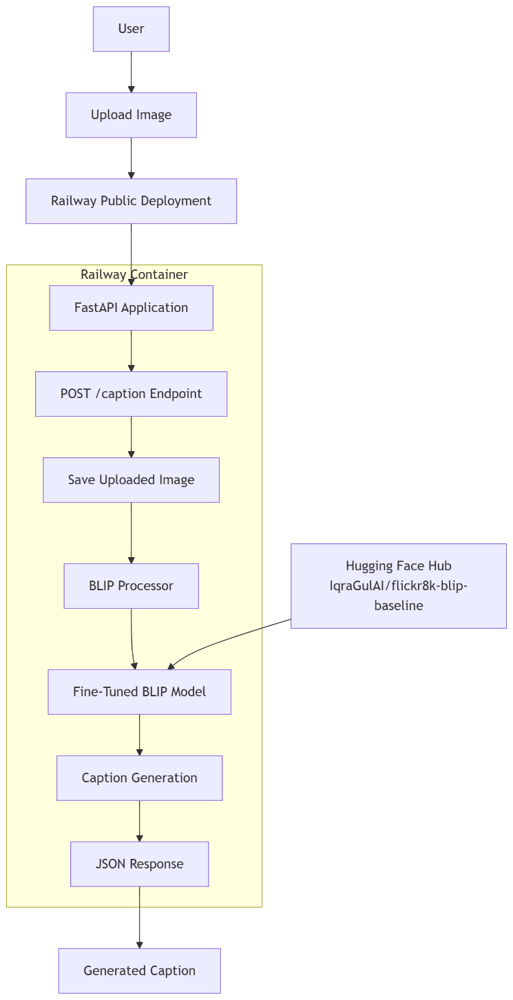

# Flickr8k BLIP Image Captioning System

## 1. Project Overview

This project implements an image captioning system using a fine-tuned BLIP (Bootstrapping Language-Image Pre-training) model.

The project covers the complete pipeline from Flickr8k dataset exploration and preprocessing to model preparation, inference, API development, Docker containerization, public deployment, and end-to-end testing.

The final application allows a user to upload an image through a publicly accessible API and receive an automatically generated caption.

## 2. Project Objectives

The main objectives of the project were:

- Explore and preprocess the Flickr8k image-caption dataset.
- Prepare and use a BLIP image-captioning model.
- Develop an inference pipeline for generating captions.
- Create a FastAPI-based API for image captioning.
- Containerize the application using Docker.
- Deploy the containerized application publicly.
- Test the deployed model using previously unseen images.
- Document the complete project pipeline and limitations.

## 3. Technologies and Tools Used

| Technology | Purpose |
|---|---|
| Python | Main programming language |
| PyTorch | Deep learning framework |
| Hugging Face Transformers | BLIP model implementation |
| Hugging Face Hub | Model hosting |
| BLIP | Image captioning model |
| FastAPI | REST API development |
| Uvicorn | API server |
| Docker | Application containerization |
| Railway | Public deployment |
| OpenCV | Image processing |
| Pillow | Image loading and processing |
| NumPy | Numerical operations |
| NLTK | Caption preprocessing |
| spaCy | Natural language processing |

## 4. Project Pipeline

The complete pipeline consists of the following stages:

### Stage 1: Dataset Exploration

The Flickr8k dataset was explored to understand:

- Number of images
- Captions associated with images
- Caption lengths
- Vocabulary
- Sample images and captions
- Potential data-quality issues

### Stage 2: Data Preprocessing

The captions were processed using NLP libraries such as NLTK and spaCy.

Image preprocessing included:

- Image loading
- Resizing
- Normalization
- Channel consistency checking

### Stage 3: Model

A BLIP-based image-captioning model was used as the baseline model.

The model files included:

- `config.json`
- `generation_config.json`
- `model.safetensors`
- `processor_config.json`
- `tokenizer.json`
- `tokenizer_config.json`

The model was uploaded to Hugging Face Hub.

Model repository: [`IqraGulAI/flickr8k-blip-baseline`](https://huggingface.co/IqraGulAI/flickr8k-blip-baseline)

## 5. Model Loading and Inference

The model loading process uses the BLIP processor and BLIP conditional-generation model.

The system automatically selects the available device:

```
CUDA GPU → if available
CPU → otherwise
```

The image is converted to RGB format and processed before being passed to the model. The model then generates a sequence of tokens representing the image caption. The generated tokens are decoded into human-readable text.

## 6. API Development

A FastAPI application was developed to provide an inference endpoint.

### Endpoint

```
POST /caption
```

### Input

The endpoint accepts an uploaded image file.

### Output

The API returns a JSON response containing the generated caption.

Example:

```json
{
    "caption": "two children running in a field of yellow flowers."
}
```

The API also accepts an optional `question` field, but VQA functionality is not supported by the current baseline model.

## 7. Project Structure

```
Internship/
│
├── app/
│   ├── main.py
│   └── gradio_app.py
│
├── src/
│   ├── data_loader.py
│   ├── inference.py
│   ├── model.py
│   ├── register_model.py
│   ├── upload_model_to_hub.py
│   └── xai.py
│
├── models/
│   └── week2_baseline_blip/
│
├── data/
│   └── Flickr8k/
│
├── notebooks/
│   ├── Day2_Flickr8k_Exploration.ipynb
│   └── Day3_Library_Test.ipynb
│
├── Dockerfile
├── docker-requirements.txt
├── requirements.txt
└── README.md
```

## 8. Architecture Diagram



## 9. Technologies Used

Python 3.11, PyTorch, Hugging Face Transformers, Hugging Face Hub, BLIP, FastAPI, Uvicorn, Docker, Railway, OpenCV, Pillow, NumPy, Pandas, Scikit-learn, NLTK, spaCy

## 10. Model

The project uses a fine-tuned BLIP image-captioning model.

Model repository: https://huggingface.co/IqraGulAI/flickr8k-blip-baseline

The model generates natural-language captions from input images.

## 11. Local Setup

### 1. Clone the repository

```bash
git clone https://github.com/Iqra123Gul/internship-project.git
cd internship-project
```

### 2. Create a virtual environment

Windows:

```bash
python -m venv venv
```

Activate it:

```bash
venv\Scripts\activate
```

### 3. Install dependencies

```bash
pip install -r requirements.txt
```

### 4. Run the API

```bash
uvicorn app.main:app --reload
```

The API will be available at:

```
http://127.0.0.1:8000
```

Swagger documentation:

```
http://127.0.0.1:8000/docs
```

## 12. Docker Setup

Build the Docker image:

```bash
docker build -t flickr8k-render .
```

Run the container:

```bash
docker run -p 8000:8000 flickr8k-render
```

Then open:

```
http://localhost:8000/docs
```

## 13. API Usage

### POST /caption

Upload an image to generate a caption.

The endpoint accepts:

| Field | Description |
|---|---|
| `file` | image file |
| `question` | optional field |

## 14. Testing

The deployed API was tested end-to-end using unseen images.

### Test 1

An image containing children in a field was uploaded.

Generated caption:

```
two children running in a field of yellow flowers.
```

### Test 2

A second unseen image was uploaded. The model successfully generated a relevant caption.

These tests demonstrate that the deployed model can perform inference on images outside the original Flickr8k dataset.

## 15. Known Limitations

The current system has several limitations:

- The application uses CPU inference in the deployment environment, which can increase inference time.
- The BLIP model is relatively large and requires significant memory.
- Model loading can take time during application startup or after a cold start.
- The current application provides image captioning only.
- VQA functionality is not implemented in the baseline deployment.
- Caption quality depends on the visual content of the input image.
- The free deployment environment may have limited computational resources.
- The current API does not implement authentication or rate limiting.

## 16. Future Work

Possible improvements include:

- Deploying the model using GPU resources.
- Implementing VQA functionality.
- Optimizing the model using ONNX.
- Model quantization.
- Adding automated model monitoring.
- Creating an Evidently AI drift report.
- Adding authentication and API rate limiting.
- Improving explainability and attention visualization.
- Developing a dedicated frontend for image uploads.
- Adding automated CI/CD deployment.
- Evaluating caption quality using metrics such as BLEU, CIDEr, ROUGE, and SPICE.

## 17. Conclusion

The project demonstrates a complete machine-learning deployment pipeline for image captioning.

Starting from the Flickr8k dataset, the project progressed through data preprocessing, model preparation, inference development, API implementation, Docker containerization, and public cloud deployment.

The final system provides a publicly accessible API where users can upload images and receive automatically generated captions. The successful testing of multiple unseen images confirms that the deployed application is functioning end-to-end.

**Railway Swagger:** https://internship-project-production-14c3.up.railway.app/docs

**GitHub:** https://github.com/Iqra123Gul/internship-project.git
